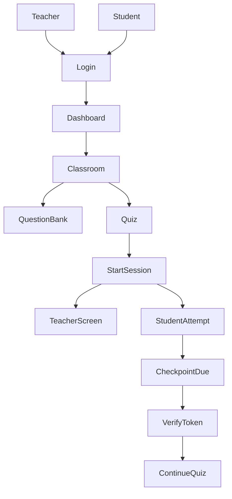

# 📐 Architecture (BKquiz)

## Tổng quan
BKquiz là hệ thống web (Next.js fullstack) phục vụ quiz trên lớp. Trọng tâm là xác nhận hiện diện bằng **token động (TOTP, stepSeconds cấu hình được – ví dụ 45s)** và **checkpoint per-student**.

## Thành phần
- **Frontend**: Next.js App Router (Teacher UI + Student UI).
  - Responsive design với mobile sidebar navigation
  - Client-side state management (React hooks, Context API)
  - Real-time updates qua polling (3s interval)
- **Backend**: Next.js Route Handlers (`app/api/...`).
  - Server-side validation và authorization
  - Time-based security checks (server-side để tránh client-side manipulation)
- **Auth**: Auth.js/NextAuth (Google OAuth trước; mở rộng SSO trường sau).
- **Database**: Postgres + Prisma.
  - JSONB fields cho flexible settings (`sessionName`, `reviewWindowMinutes`, `questionScores`)
  - Caching question scores trong `Attempt.questionScores` (JSONB)
- **Object storage (ảnh)**: S3-compatible; dev dùng MinIO.
- **Realtime (tuỳ giai đoạn)**:
  - MVP: polling Teacher Screen token/countdown, student count (3s interval).
  - Nâng cao: SSE/WebSocket.

## Các bounded context
- **Identity & Access**: user, role, auth provider.
- **Classroom**: lớp học, membership, classCode, join confirmation flow.
- **Question Bank**: pool, tag, share, CRUD question/option.
- **Quiz Authoring**: quiz, rules theo tag + pool, preview đủ/thiếu.
- **Session Runtime**: 
  - start session với custom session name
  - TOTP secret, materialize + snapshot câu hỏi
  - Auto-start/auto-end với buffer time
  - Review window configuration (10/20/30/60 phút)
- **Attempt & Scoring**: 
  - attempt, answers, submit, score
  - Question scores caching (JSONB field)
  - Student review với time-based access control
- **Presence Check**: checkpoint schedule, verify token, audit.
- **UI/UX**: 
  - Mobile responsive sidebar navigation
  - Student lobby với explicit join button
  - Class join confirmation modal

## Luồng tổng quát

## S3/MinIO (media storage) — thiết kế tối thiểu để code không lệch
- **Bucket**: `bkquiz-media`
- **Prefix**:
  - `question-assets/{poolId}/{questionId}/{filename}`
  - `import-temp/{userId}/{importId}/...` (tuỳ chọn, nếu cần debug)
- **Public/Private**:
  - MVP khuyến nghị: object **public-read** (đơn giản cho render ảnh).
  - Nếu muốn private: dùng **signed URL** (phase sau).
- **Content-Type**: set đúng theo file (`image/png`, `image/jpeg`, `image/webp`).

