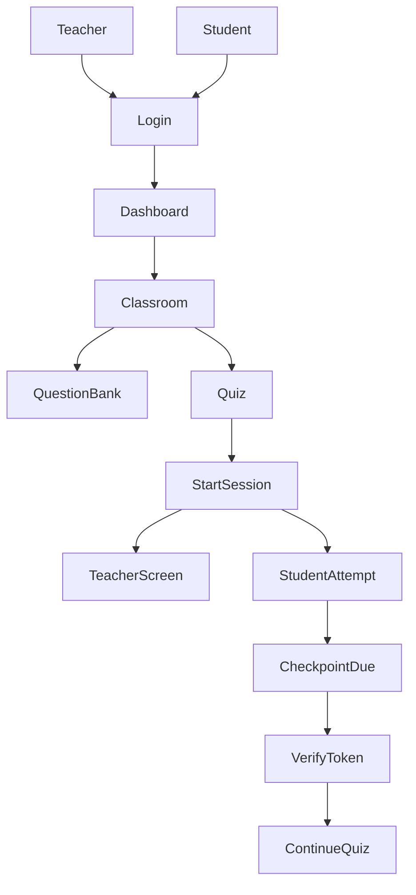

# 📐 Architecture (BKquiz)

## Tổng quan
BKquiz là hệ thống web (Next.js fullstack) phục vụ quiz trên lớp. Trọng tâm là xác nhận hiện diện bằng **token động (TOTP, stepSeconds cấu hình được – ví dụ 45s)** và **checkpoint per-student**.

## Thành phần
- **Frontend**: Next.js App Router (Teacher UI + Student UI).
- **Backend**: Next.js Route Handlers (`app/api/...`).
- **Auth**: Auth.js/NextAuth (Google OAuth trước; mở rộng SSO trường sau).
- **Database**: Postgres + Prisma.
- **Object storage (ảnh)**: S3-compatible; dev dùng MinIO.
- **Realtime (tuỳ giai đoạn)**:
  - MVP: polling Teacher Screen token/countdown.
  - Nâng cao: SSE/WebSocket.

## Các bounded context
- **Identity & Access**: user, role, auth provider.
- **Classroom**: lớp học, membership, classCode.
- **Question Bank**: pool, tag, share, CRUD question/option.
- **Quiz Authoring**: quiz, rules theo tag + pool, preview đủ/thiếu.
- **Session Runtime**: start session, TOTP secret, materialize + snapshot câu hỏi.
- **Attempt & Scoring**: attempt, answers, submit, score.
- **Presence Check**: checkpoint schedule, verify token, audit.

## Luồng tổng quát

## S3/MinIO (media storage) — thiết kế tối thiểu để code không lệch
- **Bucket**: `bkquiz-media`
- **Prefix**:
  - `question-assets/{poolId}/{questionId}/{filename}`
  - `import-temp/{userId}/{importId}/...` (tuỳ chọn, nếu cần debug)
- **Public/Private**:
  - MVP khuyến nghị: object **public-read** (đơn giản cho render ảnh).
  - Nếu muốn private: dùng **signed URL** (phase sau).
- **Content-Type**: set đúng theo file (`image/png`, `image/jpeg`, `image/webp`).

