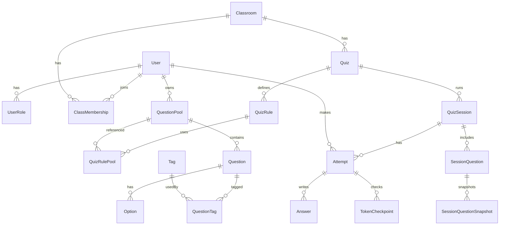

# 🗄️ Database Schema (BKquiz)

Tài liệu này là **schema chi tiết** để implement với Postgres/Prisma.

## 1) Quy ước
- `id`: UUID (default gen_random_uuid()).
- `createdAt`, `updatedAt`: timestamptz.
- Soft-delete: `deletedAt` (nullable) cho Question/Option (khuyến nghị).
- Unique:
  - `User.email`
  - `Classroom.classCode`
  - `Tag.normalizedName` (tag scope = **global**)

## 2) ERD (khái quát)

## 3) Bảng chi tiết (đề xuất)

### 3.1 `User`
- `id` uuid PK
- `email` text UNIQUE NOT NULL
- `name` text NULL
- `imageUrl` text NULL
- `createdAt` timestamptz NOT NULL
- `updatedAt` timestamptz NOT NULL

### 3.2 `UserRole`
- `userId` uuid FK -> User(id)
- `role` text CHECK IN ('teacher','student')
- PK (`userId`,`role`)

### 3.3 `Classroom`
- `id` uuid PK
- `name` text NOT NULL
- `ownerTeacherId` uuid FK -> User(id)
- `classCode` text UNIQUE NOT NULL
- `createdAt`, `updatedAt`

### 3.4 `ClassMembership`
- `classroomId` uuid FK -> Classroom(id)
- `userId` uuid FK -> User(id)
- `roleInClass` text CHECK IN ('student','ta','teacher') DEFAULT 'student'
- `status` text CHECK IN ('active','left','banned') DEFAULT 'active'
- `joinedAt` timestamptz NOT NULL
- PK (`classroomId`,`userId`)

### 3.5 `QuestionPool`
- `id` uuid PK
- `name` text NOT NULL
- `visibility` text CHECK IN ('private','shared') DEFAULT 'private'
- `ownerTeacherId` uuid FK -> User(id) NULL (nếu ownerType=group)
- `ownerType` text CHECK IN ('user','group') DEFAULT 'user'
- `ownerGroupId` uuid NULL (mở rộng group)
- `createdAt`, `updatedAt`

### 3.6 `QuestionPoolShare`
- `poolId` uuid FK -> QuestionPool(id)
- `sharedWithTeacherId` uuid FK -> User(id)
- `permission` text CHECK IN ('view','use','edit')
- `createdAt` timestamptz NOT NULL
- PK (`poolId`,`sharedWithTeacherId`)

### 3.7 `Tag`
- `id` uuid PK
- `name` text NOT NULL
- `normalizedName` text NOT NULL
- `scope` text CHECK IN ('global') DEFAULT 'global'
- `createdAt`, `updatedAt`
- UNIQUE:
  - UNIQUE(`normalizedName`)

### 3.8 `Question`
- `id` uuid PK
- `poolId` uuid FK -> QuestionPool(id)
- `type` text CHECK IN ('mcq_single','mcq_multi')
- `prompt` text NOT NULL
- `createdByTeacherId` uuid FK -> User(id)
- `createdAt`, `updatedAt`
- `deletedAt` timestamptz NULL
- Index:
  - (`poolId`)
  - (`deletedAt`)

### 3.9 `Option`
- `id` uuid PK
- `questionId` uuid FK -> Question(id)
- `content` text NOT NULL
- `isCorrect` boolean NOT NULL DEFAULT false
- `order` int NOT NULL DEFAULT 0
- `createdAt`, `updatedAt`
- `deletedAt` timestamptz NULL
- Index:
  - (`questionId`)

### 3.10 `QuestionTag`
- `questionId` uuid FK -> Question(id)
- `tagId` uuid FK -> Tag(id)
- PK (`questionId`,`tagId`)
- Index:
  - (`tagId`,`questionId`) để query theo tag

### 3.11 `Quiz`
- `id` uuid PK
- `classroomId` uuid FK -> Classroom(id)
- `title` text NOT NULL
- `createdByTeacherId` uuid FK -> User(id)
- `settings` jsonb NOT NULL DEFAULT '{}' (duration, checkpoint policy, question mode, scoring…)
- `status` text CHECK IN ('draft','published','archived') DEFAULT 'draft'
- `createdAt`, `updatedAt`
- Index:
  - (`classroomId`)

### 3.12 `QuizRule`
- `id` uuid PK
- `quizId` uuid FK -> Quiz(id)
- `tagId` uuid FK -> Tag(id)
- `count` int NOT NULL CHECK (count > 0) -- tổng số câu theo tag trong mode same-set
- `commonCount` int NULL CHECK (commonCount >= 0) -- dùng trong mode variant-set
- `variantCount` int NULL CHECK (variantCount >= 0) -- dùng trong mode variant-set
- `filters` jsonb NOT NULL DEFAULT '{}' (difficulty/type…)
- `extraPercent` numeric NULL -- override theo tag (nếu NULL thì dùng `Quiz.settings.variant.defaultExtraPercent`)
- `createdAt`, `updatedAt`
  - Thứ tự override đề xuất:
    - nếu `QuizRule.extraPercent` != NULL: dùng giá trị này
    - else nếu có `Quiz.settings.variant.perTagExtraPercent[tag]`: dùng giá trị theo tag
    - else dùng `Quiz.settings.variant.defaultExtraPercent`
- Index:
  - (`quizId`)

### 3.13 `QuizRulePool`
- `quizRuleId` uuid FK -> QuizRule(id)
- `poolId` uuid FK -> QuestionPool(id)
- PK (`quizRuleId`,`poolId`)

### 3.14 `QuizSession`
- `id` uuid PK
- `quizId` uuid FK -> Quiz(id)
- `status` text CHECK IN ('active','ended') DEFAULT 'active'
- `startedAt` timestamptz NOT NULL
- `endedAt` timestamptz NULL
- `totpSecret` text NOT NULL
- `totpStepSeconds` int NOT NULL DEFAULT 45
- Index:
  - (`quizId`)
  - (`status`)

### 3.15 `SessionQuestion`
- `sessionId` uuid FK -> QuizSession(id)
- `questionId` uuid FK -> Question(id)
- `order` int NOT NULL
- PK (`sessionId`,`questionId`)
- UNIQUE (`sessionId`,`order`)

### 3.16 `SessionQuestionSnapshot`
- `id` uuid PK
- `sessionId` uuid FK -> QuizSession(id)
- `questionId` uuid FK -> Question(id)
- `promptSnapshot` text NOT NULL
- `optionsSnapshot` jsonb NOT NULL  -- danh sách option + text
- `correctSnapshot` jsonb NOT NULL  -- đáp án đúng (ids/index) cho chấm điểm
- `createdAt` timestamptz NOT NULL
- UNIQUE (`sessionId`,`questionId`)

### 3.17 `Attempt`
- `id` uuid PK
- `sessionId` uuid FK -> QuizSession(id)
- `studentUserId` uuid FK -> User(id)
- `status` text CHECK IN ('in_progress','submitted') DEFAULT 'in_progress'
- `startedAt` timestamptz NOT NULL
- `submittedAt` timestamptz NULL
- `score` numeric NULL
- Index:
  - (`sessionId`,`studentUserId`) UNIQUE (1 attempt mỗi SV mỗi session)

### 3.17b `AttemptQuestion`
Mapping bộ câu hỏi thực tế mà một sinh viên nhận trong session (để hỗ trợ mode variant-set).
- `attemptId` uuid FK -> Attempt(id)
- `questionId` uuid FK -> Question(id)
- `order` int NOT NULL
- PK (`attemptId`,`questionId`)
- UNIQUE (`attemptId`,`order`)
- Ghi chú:
  - Question content/đáp án để hiển thị/chấm điểm vẫn dựa trên `SessionQuestionSnapshot` (session-level).

### 3.18 `Answer`
- `attemptId` uuid FK -> Attempt(id)
- `questionId` uuid FK -> Question(id)
- `selected` jsonb NOT NULL DEFAULT '[]'
  - Đề xuất MVP (ổn định + không phức tạp): lưu theo **snapshot option order**:
    - MCQ single: `[2]` nghĩa là chọn option order=2 trong snapshot
    - MCQ multi: `[1,3]`
  - Lý do: session đã freeze theo snapshot; lưu theo snapshot giúp chấm điểm/hiển thị lại luôn đúng, không phụ thuộc optionId “live”.
- `updatedAt` timestamptz NOT NULL
- PK (`attemptId`,`questionId`)

### 3.18b Điểm per-question (MVP-friendly)
MVP khuyến nghị:
- dùng `points` trong metadata import để lưu vào `Quiz.settings` hoặc `Question` (tuỳ implement).
- nếu chưa có points: mặc định **1 điểm/câu**.

### 3.19 `TokenCheckpoint`
- `id` uuid PK
- `attemptId` uuid FK -> Attempt(id)
- `dueAt` timestamptz NOT NULL
- `verifiedAt` timestamptz NULL
- `failedCount` int NOT NULL DEFAULT 0
- `lastAttemptAt` timestamptz NULL
- Index:
  - (`attemptId`)
  - (`dueAt`)

## 4) Nhóm chuyên môn (mở rộng)
### 4.1 `DepartmentGroup`
- `id` uuid PK
- `name` text NOT NULL UNIQUE
- `createdAt`, `updatedAt`

### 4.2 `GroupMembership`
- `groupId` uuid FK -> DepartmentGroup(id)
- `teacherId` uuid FK -> User(id)
- `role` text CHECK IN ('owner','member') DEFAULT 'member'
- `createdAt` timestamptz NOT NULL
- PK (`groupId`,`teacherId`)

