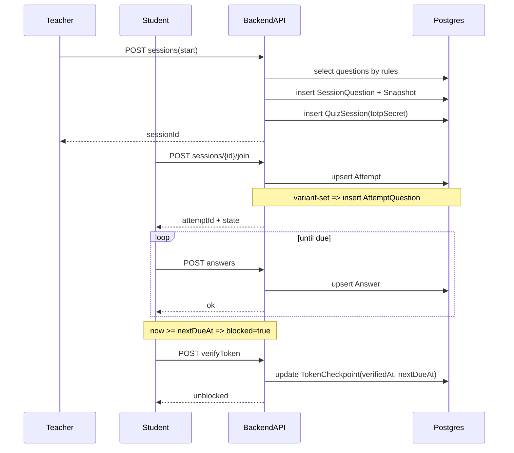

# 🔁 Flows (BKquiz)

## 1) Teacher: tạo lớp → question bank → tạo quiz → start session
- Teacher login
- Tạo `Classroom` → nhận `classCode`
- Tạo `QuestionPool` (của cá nhân hoặc của nhóm chuyên môn nếu có)
- Tạo `Tag`, gán tag cho question
- Share pool cho teacher khác (tuỳ chọn)
- Tạo `Quiz` trong class
  - Cấu hình rules theo tag + poolIds:
    - **Mode same-set**: mỗi tag chỉ rõ `count`
    - **Mode variant-set**: mỗi tag chỉ rõ `commonCount` + `variantCount` (mọi SV có common + mỗi SV có variant)
  - Preview đủ/thiếu câu theo rule
- Start `QuizSession`
  - Materialize danh sách câu hỏi theo rules:
    - same-set: chọn đúng tổng N câu cho cả session
    - variant-set: chọn đủ “session pool” cho common + variant (có thể “dôi” và cảnh báo nếu thiếu)
  - Tạo snapshot để **freeze** session
  - Sinh `totpSecret`
- Mở Teacher Screen:
  - Hiển thị **QR code lớn** chứa link join theo `sessionId` (SV scan để vào lobby/join)
  - Bên phải hiển thị **token động** + countdown (stepSeconds cấu hình, ví dụ 45s)

## 2) Student: join class → join session → làm bài + checkpoint hard-block
- Student login
- Join class bằng `classCode`
- Join session → tạo/nhận `Attempt`
  - Nếu session chưa start (teacher chưa bấm Start): hiển thị **Lobby/Waiting room** (đang chờ bắt đầu).
- Nếu quiz ở mode variant-set:
  - server gán bộ câu hỏi cho SV: tạo `AttemptQuestion` từ session pool (common + variant)
- Làm bài
  - UI khuyến nghị (MVP): hiển thị **từng câu** (pager) và **cho phép back** (navigationMode=`free`), autosave theo câu.
  - Tuỳ chọn: navigationMode=`forward_only` để không cho back (không ưu tiên cho MVP).
  - Hiển thị **progress + question navigator** (đã trả lời/chưa trả lời), hỗ trợ nhảy câu khi navigationMode=`free`.
- Sau khi verify thành công:
  - server set `nextDueAt = now + random(240..300)s`
- Đến hạn:
  - UI hiển thị “sắp đến hạn verify” (grace UI 5s) rồi hard-block (modal nhập token)
  - chỉ khi verify đúng mới được tiếp tục

### Mất mạng / quay lại (khuyến nghị UX)
- Khi mất mạng:
  - UI cho phép tiếp tục chọn đáp án **cục bộ**, nhưng hiển thị trạng thái “offline”.
  - Không cho submit khi offline.
- Khi online lại:
  - Sync answers lên server.
  - Gọi `GET /api/attempts/:attemptId/state` để lấy trạng thái thật (`blocked`, `dueAt`, `lockedUntil`…).
  - Nếu đã đến hạn checkpoint trong lúc offline: quay lại sẽ bị **block ngay** và phải verify token.

## 3) Freeze theo session (đã chốt)
Khi session đã start:
- sửa pool/question/option **không ảnh hưởng** session đang/đã diễn ra
- hiển thị lại đề + chấm điểm dựa trên snapshot

